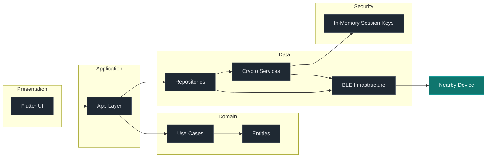

# BlueTalk

BlueTalk is a Bluetooth Low Energy (BLE) peer-to-peer messaging app built with Flutter. It focuses on secure, offline-first communication using encrypted sessions and clean architecture boundaries.

## Highlights

- Encrypted messaging with AES-GCM
- Ephemeral session keys derived via ECDH
- Offline-first BLE communication
- Clean Architecture separation of concerns
- Battery-aware BLE scanning and connection handling

## Architecture Diagram



## Documentation

- Architecture and engineering rules are in [.orchestration/README.md](.orchestration/README.md) and [.orchestration/ARCHITECTURE.md](.orchestration/ARCHITECTURE.md).
- Security specifications are in [.orchestration/security/PROTOCOL.md](.orchestration/security/PROTOCOL.md) and [.orchestration/security/THREAT_MODEL.md](.orchestration/security/THREAT_MODEL.md).

## Requirements

- Flutter SDK (stable channel)
- Platform toolchains for Android and iOS

## Quick Start

```bash
flutter pub get
flutter run
```

## Status

Active development. Protocols and security hardening are evolving.
