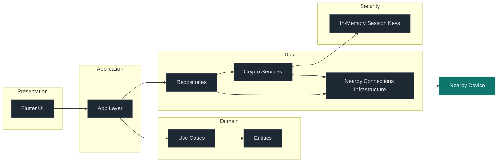

# BlueTalk

BlueTalk is an offline peer-to-peer messaging app built with Flutter and Google Nearby Connections. It focuses on direct nearby communication, clean architecture boundaries, and security hardening in progress.

## Highlights

- Nearby peer discovery and direct device-to-device messaging
- Offline-first communication with no internet required
- Transport via Google Nearby Connections API
- Clean Architecture separation of concerns
- Battery-aware scanning, advertising, and connection handling

## Current Security Status

- Transport and real-time messaging are fully working over Nearby Connections.
- End-to-end encryption migration is in progress and documented in `.orchestration/TODO.md`.

## Architecture Diagram



## Documentation

- Architecture and engineering rules are in [.orchestration/README.md](.orchestration/README.md) and [.orchestration/ARCHITECTURE.md](.orchestration/ARCHITECTURE.md).
- Security specifications are in [.orchestration/security/PROTOCOL.md](.orchestration/security/PROTOCOL.md) and [.orchestration/security/THREAT_MODEL.md](.orchestration/security/THREAT_MODEL.md).

## Requirements

- Flutter SDK (stable channel)
- Platform toolchains for Android and iOS

## Quick Start

```bash
flutter pub get
flutter run
```

## Status

Active development. Protocols and security hardening are evolving.
